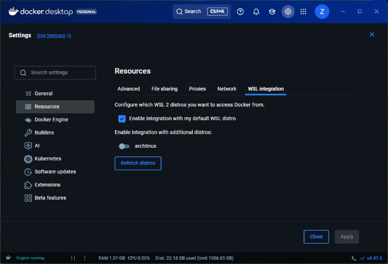

WSLだと今まではUbuntu使っていたけど、自宅サーバーのOSがArch & 新しいパッケージが使いたいので切り替え  
(Homebrew on Linuxは`/home/linuxbrew`が作られるのがあまり好みじゃない)

## 基本設定

1. PowerShellでArch Linuxをインストール

    ``` powershell
    wsl --install archlinux
    ```

1. Arch Linuxにログインしたらパッケージを最新に更新

    ``` bash
    pacman-key --init
    pacman-key --populate
    pacman -Syu
    ```

1. 最低限必要なパッケージをインストール

    ``` bash
    pacman -S base-devel git openssh
    ```

1. zshをデフォルトシェルに設定

    ``` bash
    pacman -S zsh
    chsh -s /bin/zsh
    ```

1. NeoVimをデフォルトエディターに設定

    ``` bash
    pacman -S neovim
    echo 'export EDITOR=nvim' > ~/.zshenv
    ```

1. 日本語ロケールを有効化する

    ``` bash
    sed -i -E 's/#(en_US.UTF-8)/\1/' /etc/locale.gen
    sed -i -E 's/#(ja_JP.UTF-8)/\1/' /etc/locale.gen
    locale-gen
    ```

1. wheelグループに所属しているユーザーがsudoできるように設定

    ``` bash
    echo '%wheel ALL=(ALL) ALL' > /etc/sudoers.d/wheel
    ```


1. ユーザーを作成して切り替え

    ``` bash
    useradd --create-home --groups wheel --shell /bin/zsh ユーザー名
    passwd ユーザー名
    su - ユーザー名
    ```

## ユーザー設定

1. yayをインストール

    ``` bash
    git clone https://aur.archlinux.org/yay-bin.git
    cd yay-bin
    makepkg -si
    cd ..
    rm -rf yay-bin
    ```

1. 使うパッケージを入れる

    - starship
    - sheldon
    - skim
    - ripgrep
    - bat
    - eza
    - python-uv
    - github-cli
    - less

1. GitHubに置いてある.configを配置

    ``` bash
    git clone https://github.com/zaubermaerchen/dotconfig .config
    printf "LANG=ja_JP.utf8\nZDOTDIR=\$HOME/.config/zsh\nsource \"\$ZDOTDIR/.zshenv\"\n" > .zshenv
    printf "alias vim=\"nvim\"\nalias ls=\"eza\"\nalias cat=\"bat -pP\"\n" > .config/zsh/.zshrc.local
    ```

1. 起動したとき作成したこのユーザーで実行されるように設定追加

    ``` bash
    printf "[user]\ndefault=%s\n" `whoami` | sudo tee -a /etc/wsl.conf
    ```

1. PowerShellでArch Linuxを再起動

    ``` powershell
    wsl -t archlinux
    ```

## Docker Desktop用設定

1. Arch Linuxをデフォルトにする

    ``` bash
    wsl --set-default archlinux
    ```

1. Docker Desktopのバックエンドに設定する

    Docker Desktop設定画面の「Resources」から「WSL intergration」タブを開いて、
    「Enable integration with my default WSL distro」にチェック(既にチェックが付いていたら一度外して付け直す)

    
