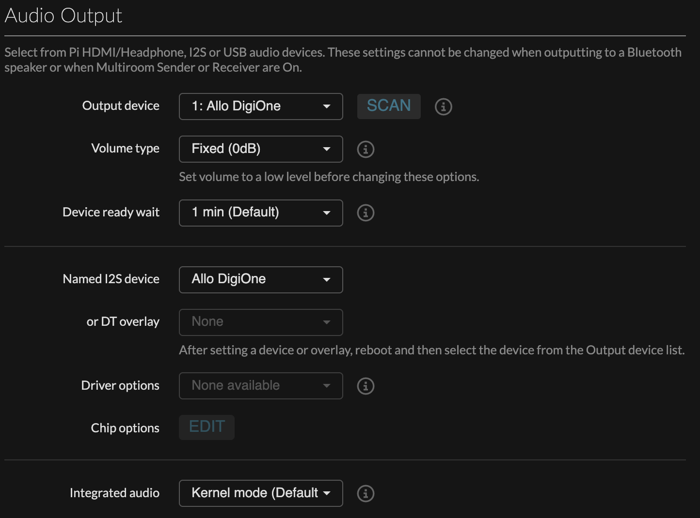
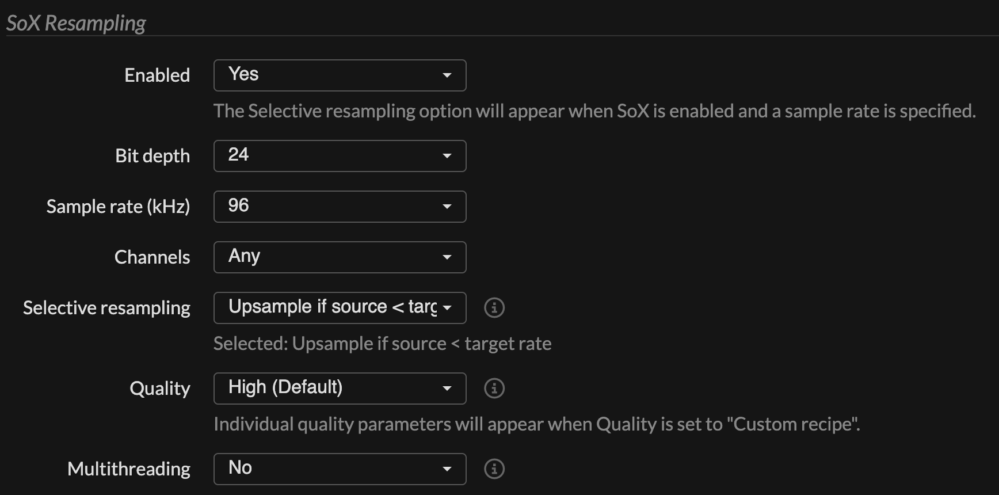
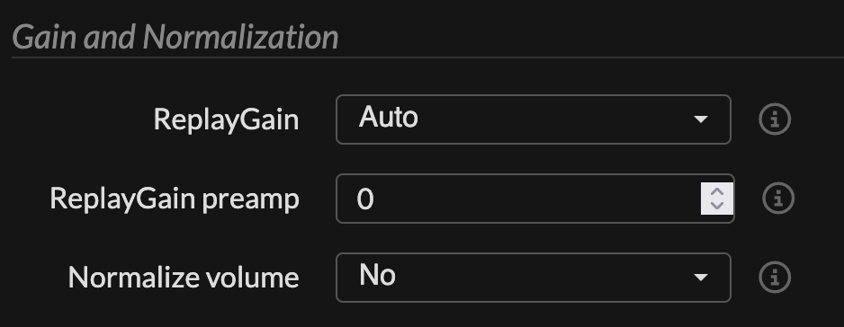
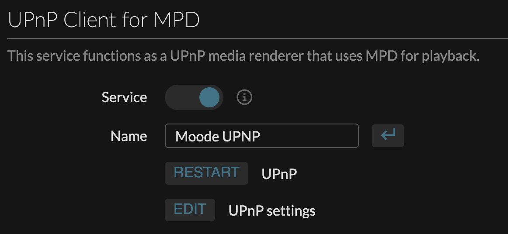
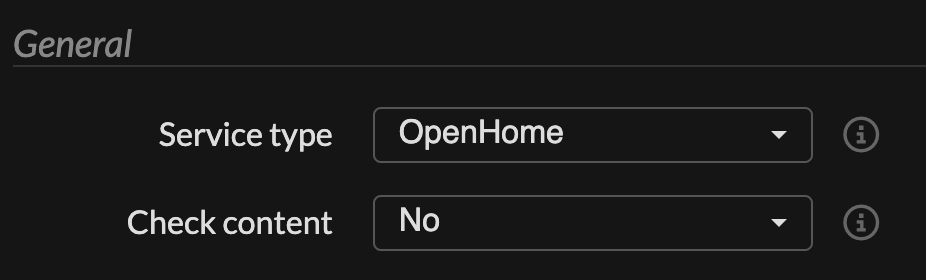

Raspberry Pi 3 Model B + Allo DigiOneにmoOde audio player 10.1.2をインストールして、OpenHomeのレンダラーとして使える状態にするまでの手順メモ

## 基本設定

[Setup Guide](https://github.com/moode-player/docs/blob/main/setup_guide.md)を参考にRaspberry Pi Imagerを使ってmicroSDにmoOdeをインストールする

- ホスト名: moode
- WiFi: 2.4GHz帯のAPを指定(Pi-3Bは5GHz帯非対応の為)
- SSH: 有効+公開鍵認証

## コンソール上での設定
1. SSHでデバイスへ接続

    ``` bash
    ssh -i 秘密鍵のパス ユーザー名@moode.local
    ```

1. パッケージを最新に更新

    ``` bash
    sudo apt upgrade -U
    ```

1. Firewallを有効化

    ``` bash
    sudo apt install ufw
    sudo ufw allow 'SSH' # SSH接続用
    sudo ufw allow 'WWW' # ブラウザ閲覧用
    sudo ufw allow 'Bonjour' # "moode.local"でアクセスするために必要
    sudo ufw allow 49152/tcp # OpenHomeのレンダラーとして使うのに必要
    sudo ufw enable
    ```

## Web画面上での設定
`moode.local`にブラウザからアクセスして、右上のメニューから各種設定を変更していく

### 音声出力先変更
デフォルトだとHDMIから音声が出力されるようになっているので、Allo Digioneから出力されるように切り替える

1. `Configure` > `Audio`からオーディオ設定画面を開く
1. `Audio Output` > `Named I2S device`を`Allo Digione`に変更して再起動
1. `Audio Output` > `Output device`を`Allo DigiOne`に変更
1. ボリュームは出力先側で調整するので、`Audio Output` > `Volume type`は`Fixed (0db)`に変更



### リサンプリング設定
音声は24bit/96KHzで出力したいのでリサンプリングを有効にする

1. `Configure` > `Audio`からオーディオ設定画面を開く
1. `MPD Options` > `MPD Settings`の`EDIT`ボタンからMPD設定画面へ移動
1. `Sox Resampling`の以下記項目を変更
    - Enable: Yes
    - Bit depth: 24
    - Sample rate (kHz): 96
    - Selective: resampling Upsample if source < target



### リプレイゲイン設定
音量がバラバラな音源でも一定の音量で再生したいのでリプレイゲインを有効にする

1. `Configure` > `Audio`からオーディオ設定画面を開く
1. `MPD Options` > `MPD Settings`の`EDIT`ボタンからMPD設定画面へ移動
1. `Gain and Normalization` > `ReplayGain`を`Auto`に変更



### UPnP設定
OpenHomeレンダラーとして使用するのでUPnP Clientを有効にする

1. `Configure` > `Renderers`からレンダラー設定画面を開く
1. `UPnP Client for MPD` > `Service`を`ON`に変更
1. `UPnP settings` > `EDIT`ボタンからUPnP設定画面へ移動
1. `General`の下記項目を変更
    - Service type: OpenHome
    - Check content: No(YesだとMP4が再生できない場合があったので)



